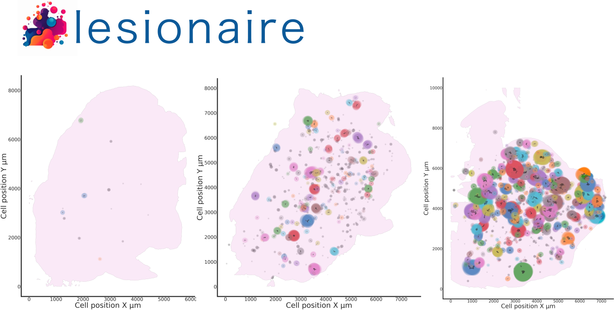

<div align="center" id="top"> 
  

  &#xa0;

  <!-- <a href="https://lesionaire.netlify.app">Demo</a> -->
</div>

<h1 align="center">Lesionaire</h1>

<p align="center">
  

  

  

  

  <!--  -->

  <!--  -->

  <!--  -->
</p>

<!-- Status -->

<!-- <h4 align="center"> 
	🚧  Lesionaire 🚀 Under construction...  🚧
</h4> 

<hr> -->

<p align="center">
  <a href="#dart-about">About</a> &#xa0; | &#xa0; 
  <a href="#sparkles-features">Features</a> &#xa0; | &#xa0;
  <a href="#rocket-technologies">Technologies</a> &#xa0; | &#xa0;
  <a href="#white_check_mark-requirements">Requirements</a> &#xa0; | &#xa0;
  <a href="#checkered_flag-starting">Starting</a> &#xa0; | &#xa0;
  <a href="#memo-license">License</a> &#xa0; | &#xa0;
  <a href="https://github.com/amagness" target="_blank">Author</a>
</p>

<br>

## :dart: About ##

Lesionaire is a small Python library for lesion size analysis and plotting with single cell spatial pathology data. The Lesionaire documentation is currently under development.

## :sparkles: Features ##

:heavy_check_mark: Easily quantify lesion size in cell coordinate data;\
:heavy_check_mark: Automatically determine boundaries of lesions;\
:heavy_check_mark: Produce summaries and plots;

## :white_check_mark: Requirements ##

Lesionaire requires 
```python
numpy 
pandas
scikit-learn, 
matplotlib 
seaborn
alphashape
descartes 
shapely
```

## :checkered_flag: Starting ##

```bash
# Clone this project
$ git clone https://github.com/amagness/lesionaire

# Access
$ cd lesionaire

# Install dependencies
$ yarn

# Run the project
$ yarn start

# The server will initialize in the <http://localhost:3000>
```

## :memo: License ##

This project is under license from MIT. For more details, see the [LICENSE](LICENSE.md) file.


Made with :heart: by <a href="https://github.com/amagness" target="_blank">{{YOUR_NAME}}</a>

&#xa0;

<a href="#top">Back to top</a>
